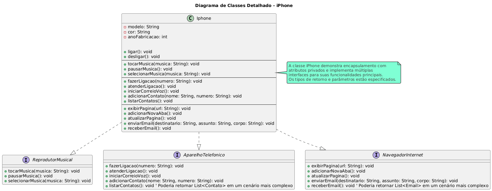

# Projeto iPhone em Java

Este projeto demonstra a implementação de um modelo simplificado de um iPhone, focando na aplicação de conceitos de Programação Orientada a Objetos (POO) como Interfaces, Polimorfismo e Encapsulamento em Java.

## 🚀 Visão Geral

O objetivo principal é simular as funcionalidades essenciais de um iPhone, separando-as em interfaces distintas: `ReprodutorMusical`, `AparelhoTelefonico` e `NavegadorInternet`. A classe `Iphone` implementa todas essas interfaces, demonstrando como um único objeto pode oferecer múltiplos comportamentos de forma coesa.

A aplicação inclui um `Main` simples para interagir com as funcionalidades do iPhone através de um menu de console, permitindo ao usuário "instanciar" um iPhone com foco em uma de suas capacidades (reprodução musical, telefonia ou navegação web), e observar como o polimorfismo restringe o acesso aos métodos apenas à interface selecionada.

## ⚙️ Tecnologias Utilizadas

* **Java 21+**
* **IntelliJ IDEA** (ou qualquer IDE Java compatível)
* **UML / PlantUML** para diagramação de classes

## 📂 Estrutura do Projeto
    .
    ├── src
    │   └── br
    │       └── com
    │           └── elvisassis
    │               ├── Main.java
    │               ├── Iphone.java
    │               ├── ReprodutorMusical.java
    │               ├── AparelhoTelefonico.java
    │               └── NavegadorInternet.java
    └── README.md
## 📋 Diagrama de Classes (UML)
O diagrama abaixo ilustra a estrutura das interfaces (`ReprodutorMusical`, `AparelhoTelefonico`, `NavegadorInternet`) e como a classe `Iphone` as implementa. Ele destaca o relacionamento "realização" (implementação) e a visibilidade (público `+`, privado `-`) de métodos e atributos.

 

note para Iphone "A classe iPhone demonstra encapsulamento com atributos privados e implementa múltiplas interfaces para suas funcionalidades principais. Os tipos de retorno e parâmetros estão especificados."

### Detalhes do Diagrama
 - Interfaces: Representam os contratos de comportamento (o que um objeto pode fazer).
 - Iphone: É a classe concreta que faz os comportamentos definidos pelas interfaces.
 - Relacionamento :(Realização/Implementação): Indica que a classe Iphone implementa as interfaces ReprodutorMusical, AparelhoTelefonico e NavegadorInternet.
 - Visibilidade:
 - + Público (métodos e atributos acessíveis de qualquer lugar).
-  +  Privado (atributos acessíveis apenas dentro da própria classe).
 - Tipos de Retorno e Parâmetros: Claramente definidos para cada método.

### Conceitos de POO Abordados
 - Interfaces: Definem um contrato de métodos que uma classe deve implementar, promovendo um design modular e flexível.
 - Polimorfismo: Permite que objetos de diferentes classes sejam tratados como objetos de um tipo comum (neste caso, as interfaces). Isso é demonstrado na classe Main ao atribuir uma instância de Iphone a uma variável de interface (ReprodutorMusical reprodutorMusical = criarReprodutorMusical()).
 - Encapsulamento: Os atributos internos do Iphone (modelo, cor, anoFabricacao) são privados, protegendo o estado interno do objeto e permitindo o acesso apenas através de métodos públicos (se existissem getters/setters, eles seriam o ponto de acesso controlado).
 - Herança (implícita via interfaces): Embora não seja herança de classes, a implementação de interfaces pode ser vista como uma forma de herança de comportamento.

### 🤝 Contribuições
Contribuições são bem-vindas! 
- Se você tiver sugestões para melhorar o código, adicionar mais funcionalidades ou refatorar, sinta-se à vontade para abrir uma issue ou enviar um pull request.